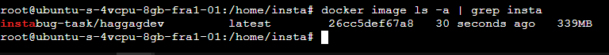

# Instabug-Internship-Task

Infrastructure Internship Challenge 2023

## Description

This project contains a Golang application that needs to be built, deployed, and tested using various infrastructure tools and technologies. The goal is to create a lightweight Docker image, set up a Jenkins pipeline for automated builds, run the application locally using Docker Compose, deploy it to Kubernetes using Helm manifests, and implement additional bonus tasks.

## Table of Contents

- [Requirements](#requirements)
- [Installation](#installation)
- [Usage](#usage)
- [Additional Tasks](#additional-tasks)
- [Bug Fix](#bug-fix)
- [API Documentation](#api-documentation)
- [Security](#security)

## Requirements

- Docker: [Installation Guide](https://docs.docker.com/get-docker/)
- Jenkins: [Installation Guide](https://www.jenkins.io/doc/book/installing/)
- Kubernetes (optional): [Minikube Installation Guide](https://minikube.sigs.k8s.io/docs/start/)

## Installation

1. Clone the repository:

```
git clone https://github.com/HosHaggag/instabug-task-source.git
```
```

2. Build the Docker image:




```
docker build -t Instabug-internship .
```

## Usage

### Jenkins Pipeline

1. Set up Jenkins and install the necessary plugins.
2. Create a new Jenkins pipeline job.
3. Configure the job to use the provided Jenkinsfile.
4. Run the pipeline and monitor the build status.

### Docker Compose

1. Ensure Docker is running on your local machine.
2. Run the following command to start the application and MySQL database:

```
docker-compose up
```

### Helm Deployment

1. Install and set up Kubernetes (e.g., Minikube).
2. Install Helm: [Installation Guide](https://helm.sh/docs/intro/install/)
3. Deploy the application to Kubernetes using the provided Helm manifests:

```
helm install <release-name> ./helm-charts
```

## Additional Tasks

### Autoscaling Manifest

To enable autoscaling of the application replicas, apply the provided autoscaling manifest:

```
kubectl apply -f autoscaling.yaml
```

### Argocd App

To set up the GitOps concept with ArgoCD, follow these steps:

1. Install ArgoCD: [Installation Guide](https://argo-cd.readthedocs.io/en/stable/getting_started/)
2. Configure ArgoCD to point to the Helm manifests directory.

### Security

Implement security measures to secure the containers. Some recommended practices include:

- Use secure base images.
- Enable container image scanning.
- Implement network policies.
- Use secrets and config maps for sensitive data.

## Bug Fix

A bug has been fixed in the code. The API should now function correctly without any known issues.

## API Documentation

Please refer to the API documentation provided in the README file of the original Golang project.

## Contributing

Contributions are welcome! If you find any issues or have suggestions, please open an issue or submit a pull request.

## License

This project is licensed under the [MIT License](LICENSE).

Feel free to modify and adapt the README file according to your specific project and implementation details. Remember to provide clear and concise instructions for each task and bonus requirement.